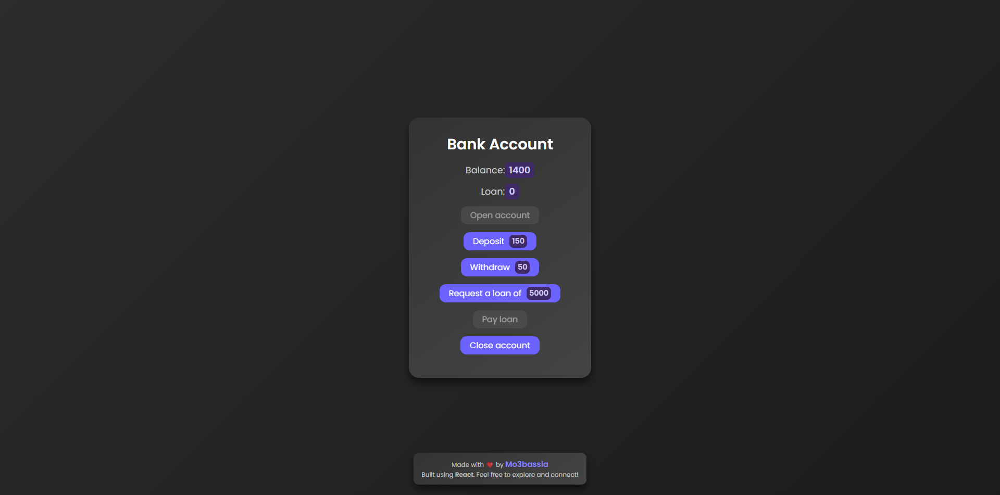

# useReducer Bank Account

You can check out the live preview of this project here: [Live Preview](https://bank-account-mo3bassias-projects.vercel.app)

This is a simple bank account management app built with React, using the `useReducer` hook. It's designed to demonstrate how `useReducer` can be applied to manage state in a more complex way than `useState`.

## Challenge Description

This app solves a simple challenge to demonstrate the use of the `useReducer` hook, which is a state management solution provided by React. The app allows the user to perform basic operations on a bank account, such as:

- Opening an account
- Depositing money
- Withdrawing money
- Requesting and paying off a loan
- Closing the account

The functionality is managed using `useReducer`, making the state transitions more predictable and scalable.

## How it Works

### `useReducer` Hook

- The `useReducer` hook is used to handle the complex state transitions in this app. It is ideal for cases where state logic is more intricate than just simple updates, such as when state changes are dependent on previous state values.

### Reducer Logic

- Each button triggers an action (e.g., deposit, withdraw, open account) that modifies the state through the reducer function. The reducer function receives the current state and an action, then returns the new state based on the action type.

## Technologies Used

- **React**: A JavaScript library for building user interfaces.
- **useReducer**: React hook for managing more complex state logic than `useState`.

---

## My Journey with React and C++

My journey in learning React started while I was also diving deep into C++ programming, where I focused on mastering the fundamentals of coding. Alongside this, I became increasingly interested in **competitive programming** and joined the **ICPC Damanhour Level 0** team. This helped me improve my problem-solving skills and introduced me to algorithms and data structures, which are crucial for both competitive programming and software development.

As I continued to grow my skills in C++, I started exploring **React** to build interactive web applications. React’s component-based architecture and state management solutions like `useState` and `useReducer` allowed me to experiment with complex state transitions, and I found it to be an excellent match for my problem-solving mindset developed through competitive programming. I applied these concepts by working on projects like this bank account app to understand how React's state management systems work in practice, especially with more advanced hooks like `useReducer`.

This journey of learning **React** has been a great experience, and it continues to complement my competitive programming skills. Both fields challenge me to think critically and improve my coding efficiency, and I’m excited to keep building on this knowledge.
